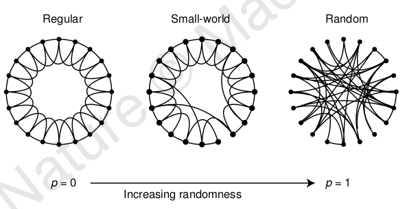

##Small-World Network##

###What is Small-World Network?###

A network is said to be a small-world network if its mean shortest path between any pair of nodes grows logarithmically with the size of nodes.

Mathematically, a network $G$ with $n$ nodes is a small-world network if its *average distance* $L$ satisfies:  
\begin{equation}  
L \propto \log(n).  
\end{equation}

Small-world properties are found in many real-world phenomena. For example, an letter delivering experiment had be conducted to find out that there are no more than about 6 steps between each pair of people in the world which is known as *six degrees separation*. 

###Erdős–Rényi (ER) model###

ER model is a simple model for generating random graphs. To generate a random graph given $n$ nodes, each possible edge is selected with a probability $p$. This generating mechanism is known as $G(n, p)$. A popular variant of ER model is $G(n, M)$ which select exactly $M$ edges from edge set of uniform distribution.

It has been proved that if $p \gg \frac{\ln(n)}{n}$ then a graph generated by model $G(n, p)$ will almost surely be connected. Purely random graphs exhibit *small-world property* along with a small *clustering coefficient* which is not consistent with small-world networks in real world whose *clustering coefficient* is high.

###Watts-Strogatz Model###

Watts-Strogatz model was proposed to generate small-world networks with *small-world property* and also with high *clustering coefficient*. To acheive this goal, Watts-Strogatz model imploy a different random graph generating mechanism $G(n, k, p)$ that starts from a regluar graph with $n$ nodes and $k$ degrees and rewires each edge with a probability $p$. Graphs generated with $p=1$ have no difference from random graphs generated by $G(n, nk/2)$.  To guarantee that a random graph will be connected, $k\gg\ln(n)$ is required. Regular graphs $G(n, k, p=0)$ are large-world networks whose *average distance* $L \propto n$ but have high *clustering coefficent* $C$. In constrast, random graphs $G(n, k, p=1)$ are poorly clustered, small-world networks whose *average distance* $L \propto \log(n)$.

However, Watts and Strogatz found out that, compared to $G(n, k, p=0)$, $L$ drops dramatically  and $C$ changes a little with a small rewiring probability $p$. In this way, a small-world network with high *clustering coefficient* can be attained. Figure 1 shows the relationships between regular graphs, small-world network and random graphs and Figure 2 shows how $L$ and $C$ change with rewiring probability $p$.

Under Watts-Strogatz model, given an actual network $G$ with $n$ nodes and $m$ edges and a random graph $G(n, m)$, small-world property in the acutal network can be identified if 
\begin{equation}
L_{actual} \approx L_{random} \wedge C_{actual} \gg C_{random}
\end{equation}

Figure 1. Watts-Strogatz Model.

Figure 2. $p$'s effections on $L$ and $C$.

###Scale-Free Model###

